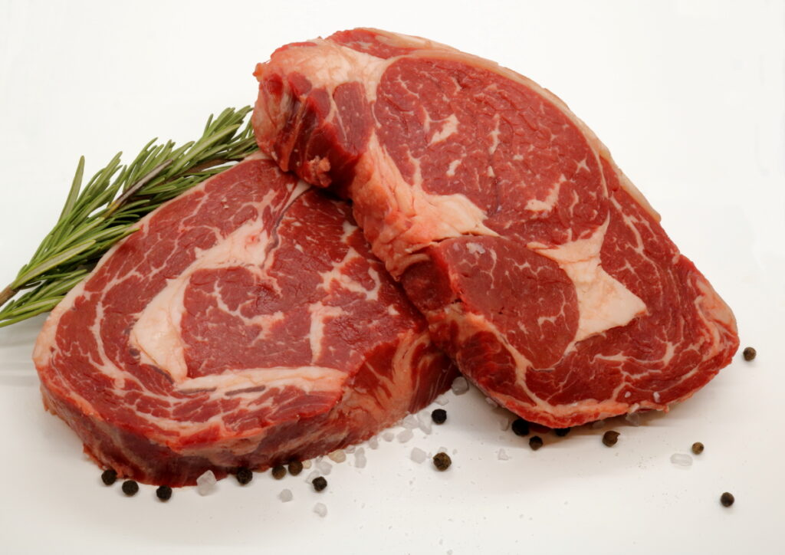

<!-- PROJECT LOGO -->
 

  

<h3 align="center">Meat Quality Assessment</h3>
  
Deep Learning model to assess the quality of red meat based on sample photos.

<!-- TABLE OF CONTENTS -->
 <h3 align="center">Table of Contents</h3>
 <ol>
 <li>
  <a href="#about-the-project">About the Project</a>
 </li>
 <li>
  <a href="#getting-started">Getting Started</a>
  <ul>
   <li><a href="#prerequisites">Prerequisites</a></li>
   <li><a href="#local-setup">Local setup</a></li>
   <li><a href="#notebooks">Notebooks</a></li>
  </ul>
 </li>
 <li>
  <a href="#testing">Testing</a>
 </li>
 <li>
  <a href="#faq">FAQ</a>
 </li>
</ol>

<!-- ABOUT THE PROJECT -->
## About the Project

Food waste is a big problem in our world.

The goal of this project is to build a Machine Learning model that predicts whether meat is edible or rotten and could therefore be consumed.

The dataset used in this project was originally built for this [research paper](https://ieeexplore.ieee.org/abstract/document/8946388) and subsequently made available on [Kaggle](https://www.kaggle.com/datasets/crowww/meat-quality-assessment-based-on-deep-learning).

(<a href="#top">back to top</a>)

## Getting Started

### Prerequisites
- Python 3.9
- [poetry](https://python-poetry.org/)
- [Kaggle](https://www.kaggle.com/) account

Since the dataset is hosted on Kaggle and not provided with the repository, it is not possible to run this code without having a Kaggle account.

### Local setup

In the repository, execute:

1. Install Poetry: `pip install poetry`
2. Install packages: `poetry install`
3. Install pre-commit hooks: `pre-commit install`
4. Follow these steps to download and set up a `kaggle.json` file with your Kaggle API token:
    1. Login into your Kaggle account
    2. Get into your account settings page
    3. Click on Create a new API token
    4. This will prompt you to download the `kaggle.json` file into your system
    5. Move the file into the root folder of the repository, and we will use it in the next step
5. Download the dataset by running `poetry run python src/scripts/setup_data.py`

### Notebooks

The project supports local usage and development by Jupyter Notebooks. Examples of the EDA, local training and local predictions on Notebooks are included in the [notebooks](notebooks/) folder.

See [README](notebooks/README.md) for more information about how to use notebooks.

(<a href="#top">back to top</a>)

## Testing

TODO

(<a href="#top">back to top</a>)

## FAQ

TODO

(<a href="#top">back to top</a>)

